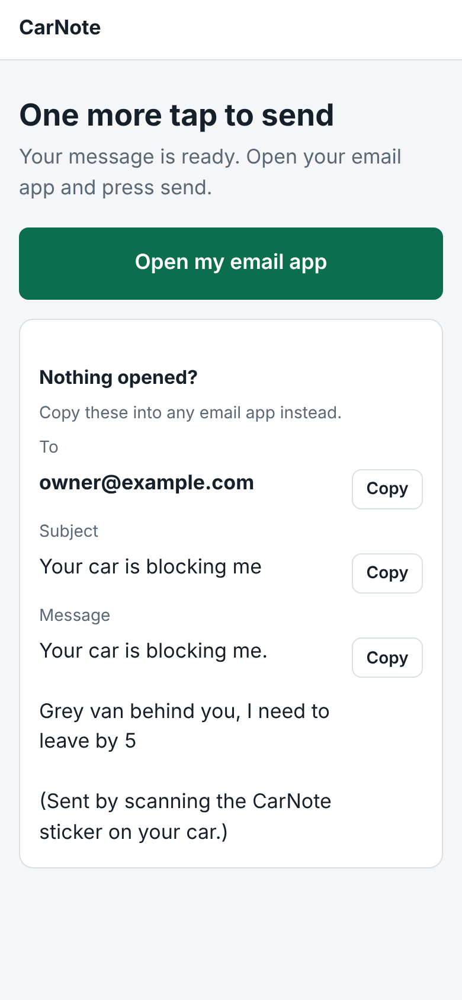

# CarNote

A QR sticker for your car. Anyone who needs to reach you (you're blocking them in, your lights are on) scans it, picks a message, and sends it to you from their own email app. You reply like any other email.

No app to install, no account, no password. The site never sends an email itself, so there is no mail server to set up or pay for.

| Owner gets a sticker | Scanner picks a message | Their email app does the sending |
|---|---|---|
|  |  |  |

## How it works

1. **The owner types in an email address** and gets a printable QR sticker straight away.
2. **Each sticker has a random code**, such as `Z4A7WM5K`. The QR code holds only that code, never the email address.
3. **A scanner picks a ready-made message** and can add a short note.
4. **Their own email app opens** with the message addressed to the owner. If no app opens, they can copy the address and text instead.

The owner gets a private "manage" link for printing, pausing or deleting the sticker. There is no login: whoever has that link controls the sticker.

## Privacy: what each side sees

- **The scanner sees the owner's email address**, and **the owner sees the scanner's**, because it is an ordinary email between them. Owners are told this when they sign up and may want an address kept just for this.
- The address is not on the page a scan opens. It appears only after the scanner writes a message, and that step is rate limited (5 times an hour per device, 30 per car), which makes addresses harder to harvest.
- Pausing a sticker hides the address. Deleting it removes the address from the database.
- The site stores the owner's email address and nothing else personal. It never sees the messages. Devices are told apart by a scrambled fingerprint, so no IP addresses are stored.

## Run it on your computer

```bash
pip install -r requirements.txt
flask --app app run --debug
```

Open http://127.0.0.1:5000.

## Run the tests

```bash
pip install pytest
pytest
```

## Put it online

Copy `.env.example` to `.env` (or set the same values in your hosting dashboard):

| Setting | What it is |
|---|---|
| `BASE_URL` | The site's public address. It is baked into every QR code, so set it before printing stickers. |
| `SECRET_KEY` | A long random string. |
| `TRUST_PROXY` | Set to `1` on hosting platforms, so rate limits see real visitor addresses. |
| `DATABASE` | Optional. Where to keep the data file. |

Start it with `gunicorn "app:create_app()"`, or use the included `Dockerfile`.

The data lives in one SQLite file (`instance/carnote.sqlite3` by default), so the host needs a disk that survives restarts.

## Project layout

```
app.py              the whole application
templates/          the pages
static/style.css    the styling
tests/test_app.py   automated tests
```

## Known limits of this prototype

- Email addresses are not verified, so a typo means messages go to the wrong person.
- A lost manage link cannot be recovered (the browser that made the sticker remembers it; otherwise make a new sticker).
- Email can be slow for urgent cases such as a blocked car.
- A scanner with no email app set up on their phone has to copy the address by hand.
