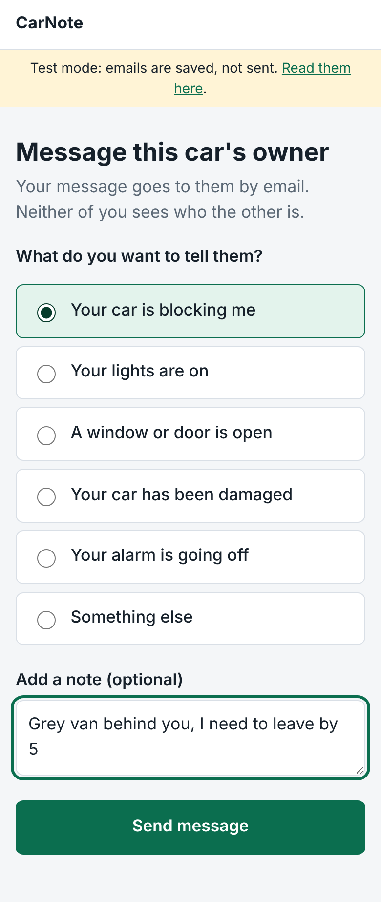
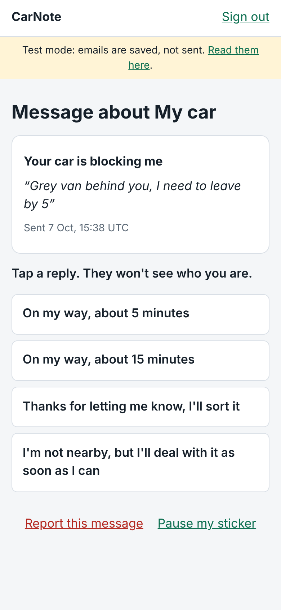
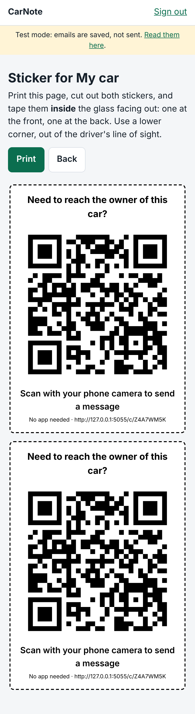

# CarNote

A QR sticker for your car. Anyone who needs to reach you (you're blocking them in, your lights are on) scans it and sends a message. You get it by email and reply with one tap. Neither side learns who the other is.

No app to install, no password, and the scanner needs no account at all.

| Scanner sends a message | Owner replies from the email | Printable sticker |
|---|---|---|
|  |  |  |

## How it works

1. **Owner signs up with an email address.** We email a sign-in link. There is no password.
2. **Each car gets a random code**, such as `Z4A7WM5K`, printed as a QR code. The code contains nothing about the owner.
3. **A scanner picks a ready-made message** and can add a short note. We email it to the owner.
4. **The owner taps a ready-made reply.** It appears on the page the scanner still has open.

## Privacy and abuse protection

- The scanner never sees the owner's email address or the car's nickname.
- The only personal data stored is the owner's email address. No number plates, phone numbers or locations.
- Devices are told apart by a scrambled fingerprint, so no IP addresses are stored.
- One device can send 3 messages an hour to a car, and a car receives at most 10 an hour.
- Links are not allowed in notes, which blocks the obvious phishing trick.
- The owner can report a message (which blocks that device) or pause the sticker, straight from the email.

## Run it on your computer

```bash
pip install -r requirements.txt
flask --app app run --debug
```

Open http://127.0.0.1:5000. With no mail server set up, the app runs in **test mode**: emails are saved and shown at `/dev/outbox` instead of being sent, so you can try the whole flow alone.

## Run the tests

```bash
pip install pytest
pytest
```

## Put it online

Copy `.env.example` to `.env` (or set the same values in your hosting dashboard):

| Setting | What it is |
|---|---|
| `BASE_URL` | The site's public address. It is baked into every QR code, so set it before printing stickers. |
| `SECRET_KEY` | A long random string that signs the email links. |
| `SMTP_HOST`, `SMTP_PORT`, `SMTP_USER`, `SMTP_PASSWORD`, `MAIL_FROM` | Your email provider's sending details. Setting `SMTP_HOST` switches test mode off. |
| `TRUST_PROXY` | Set to `1` on hosting platforms, so rate limits see real visitor addresses. |

Start it with `gunicorn "app:create_app()"`.

The data lives in one SQLite file (`instance/carnote.sqlite3`), so the host needs a disk that survives restarts.

## Project layout

```
app.py              the whole application
templates/          the pages
static/style.css    the styling
tests/test_app.py   automated tests
```

## Known limits of this prototype

- Email can be slow for urgent cases. Text or WhatsApp alerts are the obvious next step.
- Replies are ready-made only. The scanner must keep the page open to see one.
- Stickers are print-at-home. Weatherproof printed stickers would come later.
