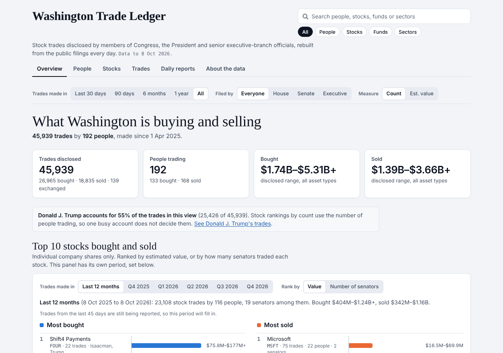
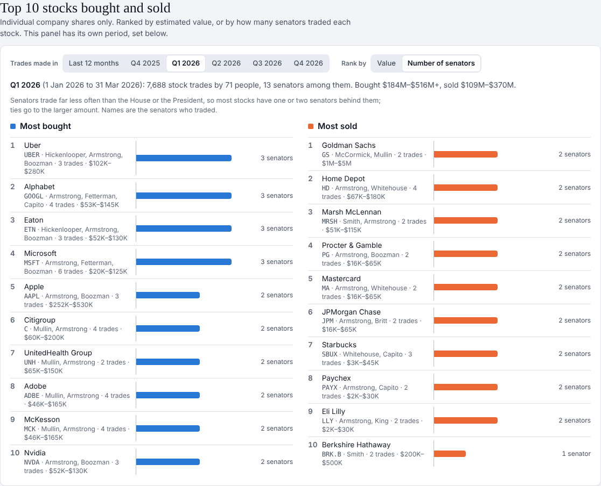
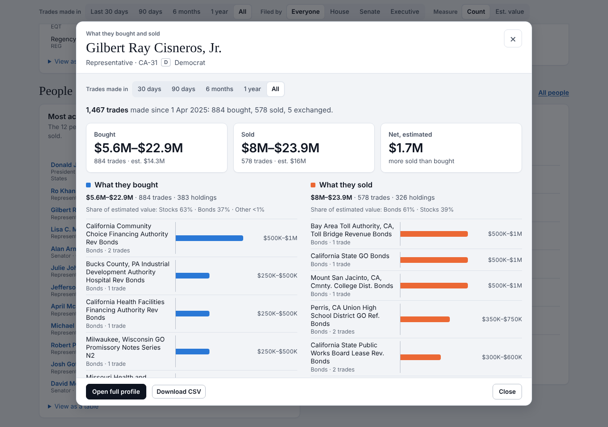
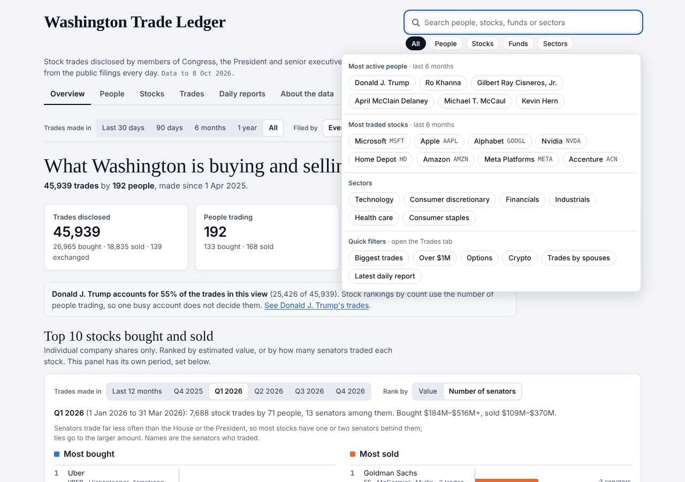

# Washington Trade Ledger

Stock trades disclosed by members of Congress, the President and senior executive-branch officials, gathered into one searchable site and rebuilt from the public filings every day.

**Live site:** https://ananyasimlai-sys.github.io/asimlai-ai/washington-trade-ledger/
(it appears once GitHub Pages is switched on; see [Publishing](#publishing-one-time-setup))

| Overview | Top 10 stocks, by quarter |
|---|---|
|  |  |
| **What one person bought and sold** | **Search chips** |
|  |  |

## What's on the site

- **Top 10 stocks bought and sold**: at the top of the Overview, the ten stocks most bought and the ten most sold in the last 12 months or in any single quarter, ranked by estimated value or by how many senators traded them, with who traded each one.
- **Overview**: trades bought and sold over time, the most traded stocks, stocks with more buyers than sellers (and the reverse), the most active people, the latest disclosures, and breakdowns by sector, asset type, trade size, owner, party and branch.
- **Most active people**: select a name to open a clean view of what that person bought and what they sold, ranked by size, with the disclosed amounts and number of trades.
- **People, Stocks, Trades**: sortable lists. Every trade can be searched, filtered and downloaded as CSV. Each person and stock has its own page.
- **Daily reports**: one report for each day anything was disclosed, readable on the site and downloadable as PDF or CSV, with a calendar to find any past day.
- **Search with chips**: search people, stocks, funds or sectors, or start from suggestion chips (most active people, most traded stocks, sectors, and quick filters such as trades over $1M).
- **Filters**: period (30 days up to the full 18 months), who filed (House, Senate, executive branch), and count or estimated value.

The data starts on 1 April 2025.

## How it stays up to date

A GitHub Actions workflow, [`.github/workflows/washington-trade-ledger.yml`](../.github/workflows/washington-trade-ledger.yml), runs every day at 14:20 UTC. It:

1. downloads the public sources (about 200 MB, all from GitHub),
2. rebuilds the whole ledger with [`pipeline/build.py`](pipeline/build.py), which uses only the Python standard library,
3. checks the result: each source must clear a minimum size, and no group may lose more than 3% of its trades compared with the live site,
4. publishes the page and the fresh data to GitHub Pages.

If a check fails, nothing is published and the site keeps the previous day's data. Each run keeps its build report as a downloadable artifact on the run's page.

To run it by hand: **Actions → Washington Trade Ledger → Run workflow**.

GitHub pauses scheduled workflows in public repositories after 60 days without any new commits. If that happens, open the workflow in the Actions tab and select **Enable workflow**.

## Publishing (one-time setup)

1. In this repository open **Settings → Pages**.
2. Under **Build and deployment**, set **Source** to **GitHub Actions**.
3. Open **Actions → Washington Trade Ledger → Run workflow** (or wait for the next daily run).

The site is then live at the address above. Until step 2 is done, each run stops early with a note saying the site is not published yet; nothing fails.

## Sources

| Part of the ledger | Source |
|---|---|
| House | [kadoa-org/congress-trading-monitor](https://github.com/kadoa-org/congress-trading-monitor): periodic transaction reports filed with the Clerk of the House, parsed |
| Senate | [KasperSK-DK/senate-ptr-data](https://github.com/KasperSK-DK/senate-ptr-data): a daily mirror of the Senate's electronic disclosure system ([efdsearch.senate.gov](https://efdsearch.senate.gov/)) |
| Executive branch | [tbrown034/open-cabinet](https://github.com/tbrown034/open-cabinet): Office of Government Ethics Form 278-T reports and the transaction pages of annual reports, for the President and about 40 senior officials |
| Ro Khanna | [kanetronv2/khanna-disclosure-explorer](https://github.com/kanetronv2/khanna-disclosure-explorer): his paper filings, transcribed (CC0) |
| Names, parties, states | [unitedstates/congress-legislators](https://github.com/unitedstates/congress-legislators) |
| Sectors and company names | [datasets/s-and-p-500-companies](https://github.com/datasets/s-and-p-500-companies) and [rreichel3/US-Stock-Symbols](https://github.com/rreichel3/US-Stock-Symbols), stored in `pipeline/names.json` |
| Weekly prices | included with the Congress Trading Monitor data |

## What it leaves out

- Reports give amounts as ranges, never exact figures. Dollar figures on the site are those ranges added up, or estimates from the middle of each range.
- A trade can be reported up to 45 days after it happens (sometimes later), so the most recent weeks fill in over time.
- House reports filed on paper before March 2026 are not in the source data. Senate reports filed on paper (nearly all Richard Blumenthal's) are listed with a link, but their trades are not transcribed.
- The Vice President and the Secretary of State have no transaction reports in these sources.
- Executive-branch reports appear after Open Cabinet has checked them, usually a few days late.
- About 0.6% of stock trades could not be matched to a ticker and are listed under the name used in the report.

This is a record of public filings, not financial advice.

## Project layout

```
index.html          the site: one page that loads data/*.json
data/               a snapshot of the data from 8 October 2026 (the live site's data is rebuilt daily)
src/index.html      the page source to edit
tools/finalize.py   turns src/index.html into index.html
pipeline/           build.py and the name and roster tables it uses
tests/features.js   browser checks (Playwright)
docs/               screenshots
```

## Working on it

- **Preview:** in this folder run `python3 -m http.server 8000` and open http://localhost:8000.
- **Change the page:** edit `src/index.html`, then run `python3 tools/finalize.py` to regenerate `index.html`.
- **Rebuild the data by hand:** `python3 -I pipeline/build.py --work /tmp/wtl-work --out /tmp/wtl-out --prev data/core.json`, then copy `/tmp/wtl-out/data/*.json` into `data/`. Exit code 2 means a check failed; the reason is in `/tmp/wtl-out/build-report.json`.
- **Tests:** instructions are at the top of `tests/features.js`.
